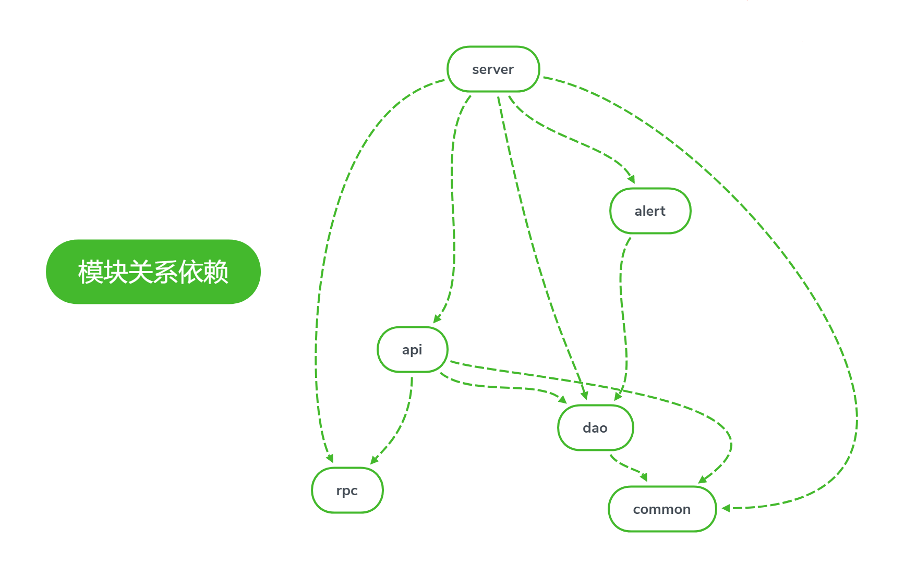

BCHT ALGORITHM ENGINE
============
### 百诚慧通算法引擎平台README文档

#### 各模块依赖关系


#### 编译步骤
- 下载项目代码
`git clone http://wyf@10.20.10.6:8080/r/bcht_algorithmic_engine.git`
***注意点：wyf用户名替换为自己的Git账号，如需进行代码提交，需对应权限，否则只能下载***

---

- 编译项目
***坑点提示***
>**在window下开发有一个大坑，就是换行默认是CRLF，也就是回车换行，但是Linux下只有换行LF，这样代码提交后，会出现编译问题，所以最好的办法是在IntelliJ下设置默认为LF**

`mvn -U clean package assembly:assembly -Dmaven.test.skip=true`
***注意点：该目录需在项目主目录下执行，在主目录target下会生成 algorithm-engine-1.0.4.tar.gz安装包***


#### 部署步骤
- 上传安装包tar.gz，并解压
`rz -bye`           => 选择本地安装包
`tar -xf algorithm-engine-1.0.4.tar.gz`

---

- 初始化数据库

---

- 修改配置文件
install.sh 的每个参数都要好好填写，认真检查
几个重点参数如下：
* installPath="/opt/algorithm-engine"  ##不能与当前路径一致
* ips="10.20.10.173"  ##安装的hosts
* hdfsStartupSate="true" ##hdfs启用开关
* zkQuorum="10.20.10.173:2181" ##zk地址

---

- 部署（自动化）
修改完install的配置参数以后，直接执行该文件就可以完成部署


#### 单个服务部署步骤
>Algorithm Engine服务有五大服务，针对某个功能块的开发，一般只需要改动其中一个模块即可，不需要对整个项目进行重新编译部署，针对单个服务的部署如下

- 对单个模块代码进行功能开发和修改
- 进行对应目录，进行编译打包 mvn clean compile package
- 在部署algorithm_engine的机器上，备份相应tar包后，将子模块中的target的tar上传至 algorithm engine的lib目录下
- 重启服务 先stop ，再start
```
## 主节点服务
sh ./bin/escheduler-daemon.sh stop master-server
sh ./bin/escheduler-daemon.sh start master-server

## 工作节点服务
sh ./bin/escheduler-daemon.sh stop worker-server
sh ./bin/escheduler-daemon.sh start worker-server

## api接口服务
sh ./bin/escheduler-daemon.sh start api-server
sh ./bin/escheduler-daemon.sh stop api-server
## 日志服务
sh ./bin/escheduler-daemon.sh start logger-server
sh ./bin/escheduler-daemon.sh stop logger-server
## 告警服务
sh ./bin/escheduler-daemon.sh start alert-server
sh ./bin/escheduler-daemon.sh stop alert-server
```


